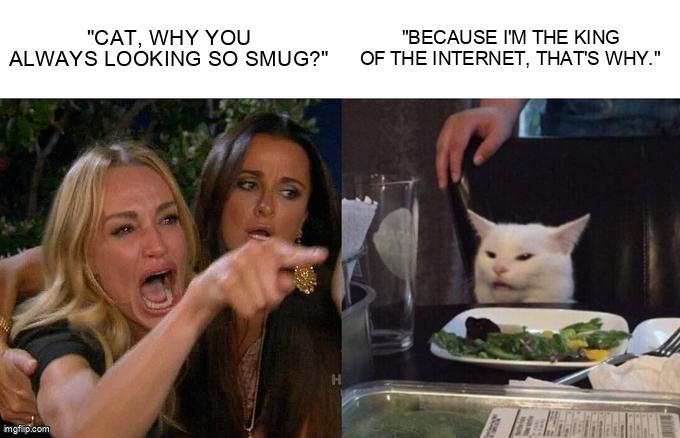
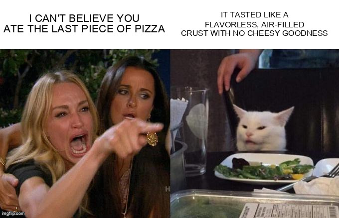

# Meme Generator Agent with Open-Source Models

A powerful AI agent that generates hilarious memes using open source models. This project combines Hugging Face models, BLIP image captioning, and the Imgflip API to create funny memes from just a keyword.

## Features

- **AI-Powered Generation**: Uses Hugging Face models for intelligent text generation
- **Image Understanding**: BLIP model for detailed image captioning and analysis
- **Meme Creation**: Imgflip API integration for professional meme generation
- **Humor Scoring**: AI evaluates meme funniness and retries if needed
- **Multiple Styles**: Sarcastic, absurd, dark humor, wholesome, and chaotic styles
- **Command Line Interface**: Easy-to-use CLI for quick meme generation
- **Programmatic API**: Use as a Python library in your own projects

## Quick Start

### Installation

1. **Clone the repository**:
   ```bash
   git clone https://github.com/robuno/meme-generator-agent
   cd meme-generator-agent
   ```

2. **Install dependencies**:
   ```bash
   pip install -r requirements.txt
   ```

3. **Set up environment variables** (optional):
   ```bash
   export HF_TOKEN="your_huggingface_token"
   export IMGFLIP_USERNAME="your_imgflip_username"
   export IMGFLIP_PASSWORD="your_imgflip_password"
   ```

### Basic Usage

**Generate a single meme**:
```bash
python main.py --keyword "cat"
```

**Generate multiple memes**:
```bash
python main.py --keyword "programming" --count 5
```

**List available templates**:
```bash
python main.py --list-templates
```

**Generate with more retries**:
```bash
python main.py --keyword "coffee" --count 1 --retry-limit 5
```

## Project Structure

```
meme-generator-agent/
├── src/                    # Source code
│   ├── __init__.py
│   ├── config.py          # Configuration settings
│   ├── models.py          # AI model management
│   ├── imgflip_api.py     # Imgflip API integration
│   ├── image_processor.py # Image processing and captioning
│   ├── caption_generator.py # Meme caption generation
│   └── meme_agent.py      # Main agent orchestration
├── main.py                # Command-line interface
├── examples.py            # Usage examples
├── requirements.txt       # Python dependencies
├── README.md             # This file
└── meme_generator_nb.ipynb # Original Jupyter notebook
```

## Configuration

The application uses a centralized configuration system in `src/config.py`:

```python
class Config:
    # Hugging Face settings
    HF_TOKEN = "your_token_here"
    
    # Model settings
    MODEL_NAME = "TheBloke/vicuna-7B-1.1-HF"
    BLIP_MODEL_NAME = "Salesforce/blip-image-captioning-large"
    
    # Imgflip API settings
    IMGFLIP_USERNAME = "your_username"
    IMGFLIP_PASSWORD = "your_password"
    
    # Generation settings
    MAX_NEW_TOKENS = 256
    MAX_RETRIES = 3
    HUMOR_SCORE_THRESHOLD = 7
```

## Usage Examples
### Command Line Interface

```bash
# Generate a single meme
python main.py --keyword "cat"

# Generate multiple memes
python main.py --keyword "programming" --count 3

# List all available templates
python main.py --list-templates

# Generate with custom retry limit
python main.py --keyword "coffee" --count 1 --retry-limit 5
```

### Programmatic Usage

```python
from src.meme_agent import MemeAgent

# Initialize the agent
agent = MemeAgent()

# Generate a single meme
meme_url = agent.generate_meme("cat", retry_limit=3)
print(f"Meme URL: {meme_url}")

# Generate multiple memes
meme_urls = agent.generate_multiple_memes("programming", num_memes=5)
for url in meme_urls:
    print(f"Meme: {url}")

# List templates
templates = agent.list_templates()
for template in templates[:5]:
    print(f"Template: {template['name']}")
```

### Running Examples

```bash
python examples.py
```

This will run through various usage examples and demonstrate different features.

## 🤖 How It Works

1. **Template Selection**: Searches Imgflip API for meme templates matching the keyword
2. **Image Analysis**: Uses BLIP model to generate detailed descriptions of the template image
3. **Caption Generation**: LLM creates funny captions based on the image description and keyword
4. **Quality Control**: AI scores the humor and retries if the meme isn't funny enough
5. **Meme Creation**: Generates the final meme using Imgflip API

## 🧠 AI Models Used

The application uses several open-source AI models for different tasks:

### Text Generation Models
- **Primary LLM**: `TheBloke/vicuna-7B-1.1-HF` - Used for generating meme captions and humor scoring
- **Alternative Models**: Can be configured to use other Hugging Face models like:
  - `HuggingFaceH4/zephyr-7b-alpha`
  - `google/gemma-2b`

### Image Understanding Models
- **BLIP Image Captioning**: `Salesforce/blip-image-captioning-large` - Analyzes meme templates and generates detailed descriptions
- **BLIP-2 Flan-T5**: `Salesforce/blip2-flan-t5-xl` - Alternative model for enhanced image understanding (optional)

### Model Tasks Breakdown

| Task | Model Used | Purpose |
|------|------------|---------|
| **Meme Caption Generation** | Vicuna-7B-1.1-HF | Creates funny top/bottom text for memes |
| **Image Description** | BLIP Image Captioning | Analyzes meme template images |
| **Humor Scoring** | Vicuna-7B-1.1-HF | Evaluates how funny generated captions are |
| **Caption Expansion** | Vicuna-7B-1.1-HF | Converts basic captions into detailed descriptions |

## Dependencies

- **transformers**: Hugging Face model loading and inference
- **langchain**: Agent orchestration and LLM integration
- **torch**: PyTorch for model inference
- **pillow**: Image processing
- **requests**: HTTP requests for API calls
- **timm**: Required for BLIP models

## API Keys

The application uses these external services:

1. **Hugging Face**: For model access (free tier available)
2. **Imgflip**: For meme generation (free tier available)

You can set credentials via environment variables:
```bash
export HF_TOKEN="your_huggingface_token"
export IMGFLIP_USERNAME="your_imgflip_username"
export IMGFLIP_PASSWORD="your_imgflip_password"
```

## Customization

### Style Hints

The agent uses different style hints for variety:
- "Make it sarcastic"
- "Make it absurd"
- "Make it dark humor"
- "Make it wholesome but funny"
- "Make it chaotic and silly"

### Configuration Options

- `HUMOR_SCORE_THRESHOLD`: Minimum humor score (1-10) for acceptable memes
- `MAX_RETRIES`: Maximum attempts per meme generation
- `MAX_NEW_TOKENS`: Maximum tokens for text generation
- `BANNED_FRAGMENTS`: Text fragments to avoid in captions

## Troubleshooting

### Common Issues

1. **Model Loading Errors**: Ensure you have sufficient RAM (8GB+ recommended)
2. **API Errors**: Check your Imgflip credentials
3. **Memory Issues**: Use CPU-only mode by modifying device_map in models.py

### Performance Tips

- Use GPU if available for faster inference
- Lower `HUMOR_SCORE_THRESHOLD` for more memes (but potentially less funny)
- Increase `MAX_RETRIES` for better quality (but slower generation)

## License

This project is open source. Feel free to use, modify, and distribute.

## Contributing

Contributions are welcome! Please feel free to submit a Pull Request.

## Support

If you encounter any issues or have questions, please open an issue on the repository.

## Examples

Here are some example memes generated by the AI agent:


*AI-generated meme*


*AI-generated meme*


*AI-generated meme*


*AI-generated meme*

---